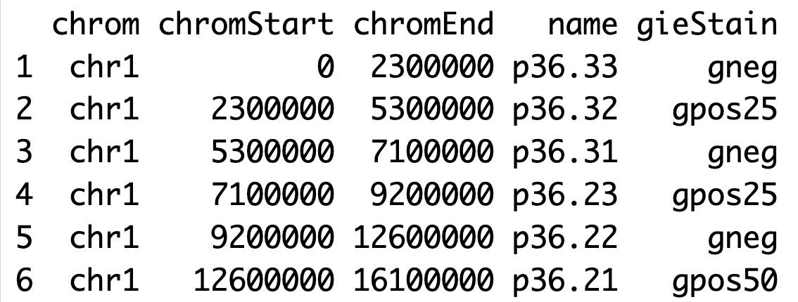
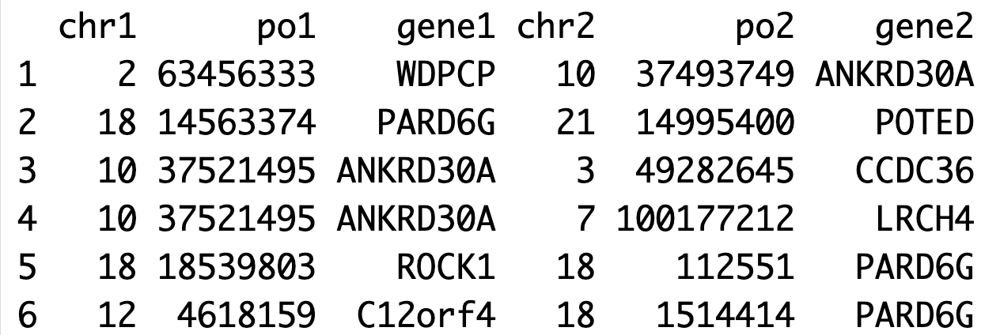

# OmicCircos_Examples
# OmicCircos install
[OmicCircos](https://bioconductor.org/packages/release/bioc/html/OmicCircos.html) was at bioconductor.
```r
if (!require("BiocManager", quietly = TRUE))
    install.packages("BiocManager")
BiocManager::install("OmicCircos")
```
# Input file formats
Four input data files are used in the package: segment data, mapping data, link data and link polygon data. Segment data are required to draw the anchor circular track. The remaining three data sets are used to draw additional tracks or connections.
### segment data
The segment data lay out the foundation of a circular graph and typically are used to draw the outmost anchor
track. In the segment data, column 1 should be the segment or chromosome names. Columns 2 and 3 are the start and
end positions of the segment. Columns 4 and 5 are optional which can contain additional description of the segment.
The package comes with the segment data for human (hg18 and hg19) and mouse (mm9 and mm10). Let’s start by
loading from the package.
```r
library(OmicCircos)
data(UCSC.hg19.chr)
head(UCSC.hg19.chr)
```
 

### mapping data

The mapping data are an R data frame which includes values to be drawn in the graph. In the mapping data,
columns 1 and 2 are segment name and position respectively. Column 3 and beyond is optional which can be the value
or name. In the following example, the third column is the gene symbol. Column 4 and 5 are the gene expression
values for each sample.

| Chromosome  | Genomic Position | gene symbol | value |
| ------------- | ------------- | ------------- | ------------- |
| chr1  | 1234  | Gene A | 135 |
| chr1  | 5678  | Gene B | 246 |

### link data 
The link data are for drawing curves between two anchor points. In the link data, columns 1, 2, 3 are the segment
name, position, label of the first anchor point; columns 4, 5, 6 are segment name, position, label of the second anchor
point Column 7 is optional and could be used for the link type description.
```r
## load the OmicCircos-package
library (OmicCircos) ;
## TCGA fusion gene data
data ( TCGA.BC.fus ) ;
head ( TCGA.BC.fus [ , c ( 1 : 6 ) ] ) 
```

 

### link polygon data
The link polygon data are for connecting two segments with a polygon graph. In the link polygon data,
columns 1, 2 and 3 are the name, start and end points for the first segment and columns 4, 5 and 6 are the name,
start and end points for the second segment.

| Chr1  | Start1 | End1 | Chr2 | Start2 | End2 |
| ------------- | ------------- | ------------- | ------------- | ------------- | ------------- |
| chr1  | 1111  | 2222 | chr2 | 5555  | 6666 |
| chr1  | 3333  | 4444 | chr2 | 7777  | 8888 |

# Exmaples

 

[R codes](R/03OMIC_CNV1_plot.R)


```r
# Remove all objects from the current R session to start with a clean environment
rm(list=ls());
# Load the OmicCircos library, which is used for generating circular plots for omics data
library(OmicCircos)
## Get input file names
cfile <- dir("../data_sets/OMIC_CNV1", "txt")
## Define a color palette with 10 semi-transparent colors
cols  <- rainbow(10, alpha=0.5)
## Loop over the input files to generate circular plots for each
for (i in 1:length(cfile)){
  ## Extract the current sample and its primary site
  id.n   <- cfile[i]
  ## Construct file paths for the CNV
  infile <- paste0("../data_sets/OMIC_CNV1/", cfile[i])
  ## Read CNV data
  cnv    <- read.table(infile, sep="\t", header=T)
  ## Construct file paths for the FUSION
  inf2   <- paste0("../data_sets/OMIC_FUSION/", cfile[i]);
  ## Read fusion data
  dat    <- read.table(inf2, sep="\t", header=T)
  ## Calculate cutoff of CNV
  c.m    <- mean(cnv[,3])
  ## Define an output file name for the circular plot PDF
  pdff <- paste0("../out/", id.n, ".pdf")
  ## Create a PDF device for plotting, with a size of 8 by 8 inches
  pdf(pdff, 8, 8);
  ## Set the margins of the plot
  par(mar=c(2, 2, 2, 2));
  ## Initialize a blank plot with custom dimensions
  plot(c(1,800), c(1,800), type="n", axes=F, xlab="", ylab="", main=id.n);
  ## Plot the chromosomes on the circular plot with specified radius, chromosome annotation, and scaling
  circos(R=350, cir="hg19", W=10, type="chr", print.chr.lab=T, scale=T);
  ## Add copy number variation (CNV) data to the circular plot
  circos(R=200, cir="hg19", W=160,  mapping=cnv, col.v=3, type="b2", 
         B=F, lwd=1, cutoff=c.m, col=cols[c(2,7)]);
  ## Add fusion data to the circular plot as links
  circos(R=200, cir="hg19", mapping=dat, type="link", lwd=2, col=cols[1]);
  dev.off()
}
```

 

[R codes](R/03OMIC_CNV2_plot.R)

```r
## Remove all objects from the current R session to start with a clean environment
rm(list=ls());
## Load the OmicCircos library, which is used for generating circular plots for omics data
library(OmicCircos)
## Get input file names
cfile <- dir("../data_sets/OMIC_CNV1", "txt")
## Define a color palette with 10 semi-transparent colors
cols  <- rainbow(10, alpha=0.5)[c(1,7,2,9,6)]
## Define an output file name for the circular plot PDF
pdff <- paste0("../out/04OMIC_CNV2_plot.pdf")
## Create a PDF device for plotting, with a size of 8 by 8 inches
pdf(pdff, 8, 8);
## Set the margins of the plot
par(mar=c(2, 2, 2, 2));
## Initialize a blank plot with custom dimensions
plot(c(1,800), c(1,800), type="n", axes=F, xlab="", ylab="", main="")
## Plot the chromosomes on the circular plot with specified radius, chromosome annotation, and scaling
circos(R=400, cir="hg19", W=10, type="chr", print.chr.lab=T, scale=T);
## Initial radius
R <- 340
## Loop over the input files to generate circular plots for each
for (i in 1:length(cfile)){
  id.n   <- cfile[i]
  ## Input CNV file
  infile <- paste0("../data_sets/OMIC_CNV2/", cfile[i])
  ## Read CNV data
  cnv    <- read.table(infile, sep="\t", header=T)
  ## Calculate cutoff of CNV
  c.m    <- mean(cnv[,5])
  ## Input fusion file
  inf2   <- paste0("../data_sets/OMIC_FUSION/", cfile[i]);
  ## Read fusion data
  dat    <- read.table(inf2, sep="\t", header=T)
  ## Generate index of ploting backagroud, such as B option 
  b.i <- i%%2
  ## Plot CNV
  if (b.i==1){
    circos(R=R, cir="hg19", W=40,  mapping=cnv, col.v=5, type="ml3", 
           B=F, lwd=2, cutoff=2, col=cols[i]);
  } else {
    circos(R=R, cir="hg19", W=40,  mapping=cnv, col.v=5, type="ml3", 
           B=T, lwd=2, cutoff=2, col=cols[i]);
  }
  ## Plot fusions
  R <- R - 40
  circos(R=160, cir="hg19", mapping=dat, type="link", lwd=2, col=cols[i]);
}
## Plot legend 
legend("topleft", legend=paste0("SampleID1-5"), 
       bty="n", cex=0.8, title="Outside(CNV)")
legend("topright", legend=paste0("SampleID",1:5), lwd=2, col=cols, 
       bty="n", cex=0.8, title="Inside(Fusion)")

dev.off()

```

 

[R codes for one single sample](R/01plot_COSMIC_s.R) <br />
[R codes for all samples](R/01plot_COSMIC.R) 

```r
## Remove all objects from the current R session to start with a clean environment
rm(list=ls());
## Load the OmicCircos library, which is used for generating circular plots for omics data
library(OmicCircos)
## Define a vector of phenotype IDs to be used in the analysis
COSMIC_PHENOTYPE_ID  <- c("COSO29914830", "COSO32054826", "COSO29914826")
## Corresponding primary sites for each phenotype ID
PRIMARY_SITE <- c("lung", "prostate", "lung")
## Define a color palette with 10 semi-transparent colors
cols  <- rainbow(10, alpha=0.8) 
## Loop over the phenotype IDs to generate circular plots for each
for (p.i in 1:length(COSMIC_PHENOTYPE_ID)){
  ## Extract the current phenotype ID and its primary site
  tid    <- COSMIC_PHENOTYPE_ID[p.i]
  tname  <- PRIMARY_SITE[p.i]
  ## Construct file paths for the CNV, gene expression, and fusion data files based on the phenotype ID and primary site
  cnv.f  <- paste0("../data_sets/COSMIC_CNV/", tid, "_", tname, ".txt")
  gexp.f <- paste0("../data_sets/COSMIC_EXP/", tid, "_", tname, ".txt")
  fus.f  <- paste0("../data_sets/COSMIC_FUSION/", tid, "_", tname, ".txt")
  ## Read the data from the constructed file paths into data frames
  cnv    <- read.table(cnv.f, header=T)
  gexp   <- read.table(gexp.f, header=T)
  fus    <- read.table(fus.f, header=T)
  ## Define an output file name for the circular plot PDF
  pdff <- paste0("../out/OC_", tid, "_", tname, ".pdf")
  ## Create a PDF device for plotting, with a size of 8 by 8 inches
  pdf(pdff, 8, 8);
  ## Set the margins of the plot
  par(mar=c(2, 2, 2, 2));
  ## Initialize a blank plot with custom dimensions
  plot(c(1,800), c(1,800), type="n", axes=F, xlab="", ylab="", main="");
  ## Plot the chromosomes on the circular plot with specified radius, chromosome annotation, and scaling
  circos(R=400, cir="hg19", W=4, type="chr", print.chr.lab=T, scale=T);
  ## Add a heatmap to the circular plot representing gene expression data
  circos(R=260, cir="hg19", W=140, mapping=gexp[,c(1:20)],  col.v=4,  type="heatmap2", 
         lwd=0.1);
  ## Add copy number variation (CNV) data to the circular plot
  circos(R=110, cir="hg19", W=160,  mapping=cnv, col.v=4, type="b2", 
         B=F, lwd=1, cutoff=2, col=cols[c(2,7)]);
  ## Add fusion data to the circular plot as links
  circos(R=120, cir="hg19", mapping=fus, type="link", lwd=1, col=cols[1]);
  ## Close the PDF device, which saves the plot to a file
  dev.off()
}

```

 

[R codes](R/02plot_COSMIC_gene.R)

```r
## Remove all objects from the current R session to start with a clean environment
rm(list=ls());
## Load the OmicCircos library, which is used for generating circular plots for omics data
library(OmicCircos)
## Define a vector of phenotype IDs to be used in the analysis
COSMIC_PHENOTYPE_ID  <- c("COSO29914830", "COSO32054826", "COSO29914826")
## Corresponding primary sites for each phenotype ID
PRIMARY_SITE <- c("lung", "prostate", "lung")
## Define a color palette with 10 semi-transparent colors
cols   <- rainbow(10, alpha=0.8)[c(1,2,9,7)] 
## Read gene label file
gene   <- read.table("../data_sets/COSMIC_GENE/gene.txt", header=T)
## Get index for each gene
row.i  <- 1:nrow(gene)
## Get the index for outside and inside label index
g.i    <- which(row.i%%2==1)
## Define an output file name for the circular plot PDF
pdff <- paste0("../out/02plot_COSMIC_gene.pdf")
## Create a PDF device for plotting, with a size of 8 by 8 inches
pdf(pdff, 8, 8);
## Set the margins of the plot
par(mar=c(2, 2, 2, 2));
## Initialize a blank plot with custom dimensions
plot(c(1,800), c(1,800), type="n", axes=F, xlab="", ylab="", main="");
## Plot the chromosomes on the circular plot with specified radius, chromosome annotation, and scaling
circos(R=290, cir="hg19", W=4, type="chr", print.chr.lab=T, scale=T);
## Plot genes at outside
circos(R=325, cir="hg19", W=20, mapping=gene[g.i,], type="label", 
       side="out", col=c("black"), cex=c(0.4));
## Plot genes at inside
circos(R=280, cir="hg19", W=20, mapping=gene[-g.i,], type="label", 
       side="in", col=c("black"), cex=c(0.4));
## Plot fussions for each sample with different colors
for (p.i in 1:length(COSMIC_PHENOTYPE_ID)){
  ## Extract the current phenotype ID and its primary site
  tid    <- COSMIC_PHENOTYPE_ID[p.i]
  tname  <- PRIMARY_SITE[p.i]
  ## Construct file paths for fusion
  fus.f  <- paste0("../data_sets/COSMIC_FUSION/", tid, "_", tname, ".txt")
  ## Read fusion data
  fus  <- read.table(fus.f, header=T)
  ## Add fusion data to the circular plot as links
  circos(R=200, cir="hg19", mapping=fus, type="link", lwd=1, col=cols[p.i]);
}

dev.off();

```

# Exmaples for online OmicCircos

### [OmicCircos APP (online)](https://www.cancergenomicscloud.org/)

### Output figure

 

### Requirement and parameters

Browser: google chrome

Built-in data:

Segments:
Hg18

Data:
Mapping: TCGA BC exp, cnv, cnv_exp
Link data: TCGA BC fusion

Create plot:
1.	Chr: hg18, radius=400, width=10, draw chr
2.	Heatmap2: hg18, gene.exp.2k, radius=300, width=100, choose column, add color, draw scale and color
3.	ML steps (ML3): cnv.2k, radius=210, width=80, cutoff=0
4.	Line plot (L): her_cnv_exp, radius=140, width=80, pvalue (colum), choose color, draw background (adv)
5.	Link(link2): bc fus, radius=130, width=40, color (repeat 18)

Add title and legend (top left of the plot):
	Title: any thing
	Legend: position, then each circle from outside to inside

### The R code could run on the local

[R codes](R/OmicCircos_app_demo.R)

```r
## Remove all objects from the current R session to start with a clean environment
rm(list=ls())
## Load the OmicCircos library, which is used for generating circular plots for omics data
library(OmicCircos);
## load the data sets from OmicCircos package
## fusion data
data("TCGA.BC.fus");
## CNV data
data("TCGA.BC.cnv.2k.60");
## gene expression data
data("TCGA.BC.gene.exp.2k.60");
## sample ID and cancer types
data("TCGA.BC.sample60");
## p values for the association between CNV and gene expression
data("TCGA.BC_Her2_cnv_exp");
## transform p values by -log10
pvalue <- -1 * log10(TCGA.BC_Her2_cnv_exp[,5]);
## p value mapping data
pvalue <- cbind(TCGA.BC_Her2_cnv_exp[,c(1:3)], pvalue);
## Her2 sub-type data
Her2.i <- which(TCGA.BC.sample60[,2] == "Her2");
Her2.n <- TCGA.BC.sample60[Her2.i,1];
## CNV mapping data for Her2 sub-type
Her2.j <- which(colnames(TCGA.BC.cnv.2k.60) %in% Her2.n);
cnv    <- TCGA.BC.cnv.2k.60[,c(1:3,Her2.j)]; 
cnv.m  <- cnv[,c(4:ncol(cnv))];
cnv.m[cnv.m >  2] <- 2;
cnv.m[cnv.m < -2] <- -2;
cnv <- cbind(cnv[,1:3], cnv.m);
## gene expression mapping data for Her2 sub-type
Her2.j   <- which(colnames(TCGA.BC.gene.exp.2k.60) %in% Her2.n);
gene.exp <- TCGA.BC.gene.exp.2k.60[,c(1:3,Her2.j)]; 
## initial colors
colors <- rainbow(10, alpha=0.5);
## Set the margins of the plot
par(mar=c(0, 0, 0, 0));
## Initialize a blank plot with custom dimensions
plot(c(1,800), c(1,800), type="n", axes=FALSE, xlab="", ylab="", main="");
## Plot the chromosomes on the circular plot with specified radius, chromosome annotation, and scaling
circos(R=400, cir="hg18", W=4,   type="chr", print.chr.lab=TRUE, scale=TRUE);
## Plot heatmap
circos(R=300, cir="hg18", W=100, mapping=gene.exp,  col.v=8,  type="heatmap2", 
       cluster=FALSE, col.bar=TRUE, lwd=0.1, col="blue");
## Plot CNV
circos(R=220, cir="hg18", W=80,  mapping=cnv,   col.v=4,   type="ml3", B=FALSE, lwd=1, cutoff=0);
## Plot CNV
circos(R=140, cir="hg18", W=80,  mapping=pvalue,  col.v=4,    type="l",   B=TRUE, lwd=1, col=colors[1]);
## Add fusion data to the circular plot as links
cols        <- rep(colors[7], nrow(TCGA.BC.fus));
col.i       <- which(TCGA.BC.fus[,1]==TCGA.BC.fus[,4]);
cols[col.i] <- colors[1];
circos(R=130, cir="hg18", W=10,  mapping=TCGA.BC.fus, type="link2", lwd=2, col=cols);

```


